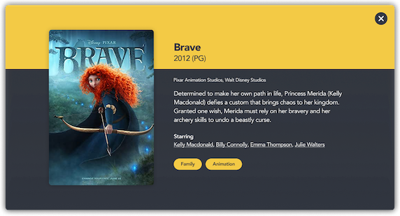

# Navis Movie Night
The movie application consists of two components, a React UI and a Java server backend written in Spring Boot. The application is fully self contained and can be run from your local machine with no need to access external systems.

This application is not a production system and is only used for purposes as an interview exercise.

## Full-Stack Engineer
We have implemented the application but now have found 3 defects that we need you to fix. Please address these defects and submit the code for review.

### Defects
Please resolve the following defects:

**Defect 1**

Selecting a movie 'card' shows a message that "No Movie Found." When a card is selected the detail modal view should be shown to the user.

The detail view shown should look like:

**Defect 2**

Searching by genre is broken. Whenever I select a genre it appears not to filter the content at all.

**Defect 3**

Searching by Title and Actor is inconsistent in the results returned. I know that Mike Myers is an actor in the Shrek films. When I search for 'mike' nothing is returned. Similar behavior for seaching titles. Sometimes I see values and sometimes I do not.

### Extra Credit
1. Create or update tests to ensure we do not encounter these defects again.
2. Implement a search by genre or actor from the detail view

### Expectations of delivery
1. *Before you begin your work, set up change tracking via `git init` (do not set up a remote)*
2. As you work through your solution, commit changes regularly with appropriate comments
3. Submit your solution as follows:
   * Please run `git clean -xdf` in the root solution folder in order to reduce the size of your submission
   * Package & compress the solution into a zip file, including the .git folder showing your changes
   * Use a cloud storage provider (such as Google Drive, Dropbox, etc.) to send the zip file submission as a link

### Component Info
Information for each component can be found here:
  - [Client](client/README.md)
  - [Server](server/README.md)
